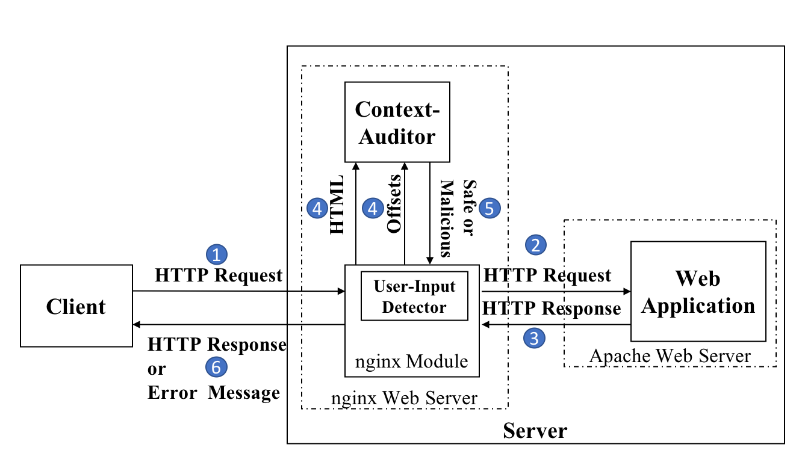
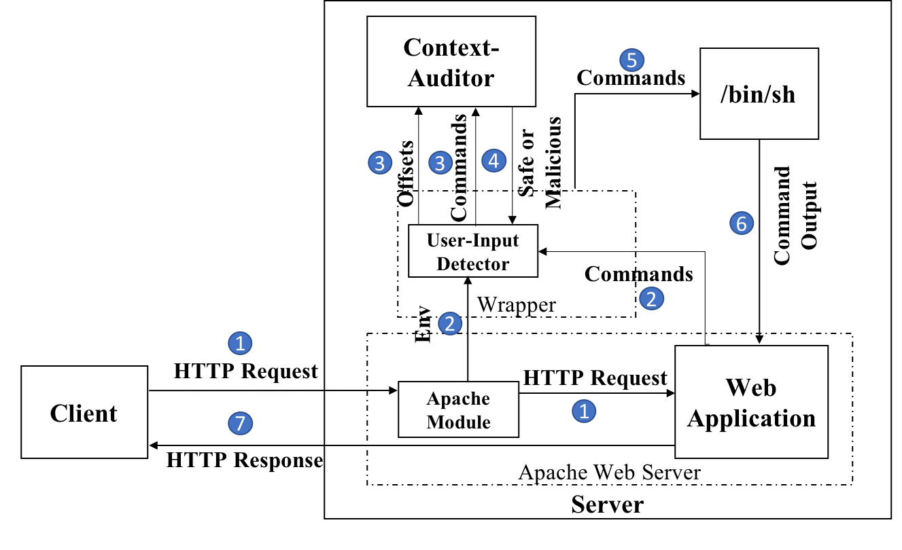

# Context-Auditor

Context-Auditor is a tool for context-sensitive mitigation of content injection vulnerabilities in web applications.

For more information, you can refer to our [RAID 2022](https://raid2022.cs.ucy.ac.cy) paper titled: [Context-Auditor: Context-sensitive Content Injection Mitigation](Context-Auditor.pdf).

Context-Auditor is a parsing analysis module that detects potential content injection vulnerabilities in a piece of content (e.g., HTML, bash command, etc.) with the assumption that bytes of untrusted user inputs are known to it.
It can detect a broad spectrum of injection exploitations such as Cross-site Scripting, CSS injection, HTML injection, command injection, and theoretically other types of injections in web applications that trigger a context switch in an underlying parser.

Context-Auditor is designed with the concept of a Two-way Pushdown Automaton (2PDA). To implement Context-Auditor, we have used specifications and grammar rules of three web languages (HTML5, CSS, JavaScript) that you can find its source code in the [htmlParser](htmlParser) directory. This module can detect Cross-site Scripting, JavaScript, CSS, and HTML injection.
To demonstrate the extensibility of our approach, we have also implemented a bash parsing module (to detect command injection exploitations) that you can find in the [shellParser](shellParser) directory.

## Deployment of HTML Parser
Since we have provided a stand-alone detection module, we can freely place Context-Auditor anywhere along the client-server model of a web application. 
It only needs to be fed with the right inputs. Here, it needs to know the HTML content and the byte offsets of untrusted user inputs inside it. 
Then, it will take care of the parsing analysis task and tell you whether any context switch was triggered by any byte of the untrusted user input; 
if so, it will flag it as a content injection exploitation. 

To demonstrate the flexibilty of Context-Auditor, We have deployed it in three different locations:  

### 1. Context-Auditor as a web proxy

This deployment aims to flag any content injection triggered due to the reflection of an untrusted URL parameter in the HTML content.
We have used [mitmproxy](https://mitmproxy.org) and integrated Context-Auditor as a python module for this web proxy. 
This module filters out any HTML response identified as having a content injection exploitation and prevents it from reaching the client side.
More information on this deployment scenario is in the [mitmproxy-config](mitmproxy-config) repository.

### 2. Context-Auditor as an Nginx module 

This deployment aims to flag any content injection triggered due to the reflection of an untrusted URL parameter in the HTML content.
Since this deployment wants to prevent exploitation in the server side, we had the following depoylment scenario for our defense and Context-Auditor:

The above figure shows that the server-side web application (that could be vulnerable) is hosted in an apache web server. 
Nginx (which also deploys Context-Auditor) is configured in the reverse proxy setting: meaning that any request coming to the web application first goes through Nginx and 
then it will forward the request to the apache webserver. 
Similarly, it also proxies the corresponding HTML responses. 
Therefore, it has access to both the HTML content and values of untrusted user inputs and can invoke Context-Auditor for further analysis and detection of content injection exploitations. 
In the case of content injection exploitation, Nginx prevents the HTML response from reaching the client-side web application.
More information on this deployment scenario is in the [nginx-config](nginx-config) repository.

### 3. Context-Auditor in a Chrome extension
In this deployment, we wanted a passive content injection analysis on URL parameters and HTML responses and logged any raised flags. 
We have used [Tamper Extension](https://github.com/dutzi/tamper) for this purpose.
More information on this integration is in [extension-config](extension-config) repository.

### Deployment of Shell Parser

We can deoploy the Shell parsing module as a wrapper around ``\bin\sh`` as follows:

More information on the deployment is in the [shellParser](shellParser) directory.
